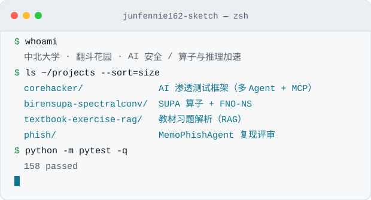
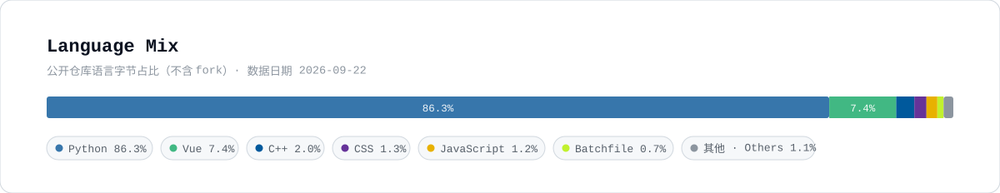

  <picture>
    <source media="(prefers-color-scheme: dark)" srcset="./assets/banner-dark.svg" />
    
  </picture>

  
  &nbsp;
  
  &nbsp;
  

<table width="100%">
  <tr>
    <td width="56%" valign="top">
      
我是中北大学<b>「翻斗花园」</b>小队的成员，主线是 <b>LLM 应用工程</b>：把检索增强（RAG）和 Agent 工具调用做成能跑、能测、能交付的东西 😺

      <ul>
        <li>🔭 <b>在做</b>：<a href="https://github.com/junfennie162-sketch/textbook-exercise-rag"><code>textbook-exercise-rag</code></a> —— 教材习题解析生成器，混合检索 + 引用可追溯 + 可调参的模型设置面板，后端已有 <b>158 项测试</b></li>
        <li>🧮 <b>竞赛</b>：<a href="https://github.com/junfennie162-sketch/birensupa-spectralconv"><code>birensupa-spectralconv</code></a> —— 在国产卡（壁仞 106B）上用 SUPA 写算子、训神经算子</li>
        <li>🛡️ <b>折腾</b>：渗透测试 AI —— 自己写框架（<a href="https://github.com/junfennie162-sketch/corehacker"><code>corehacker</code></a>），也读别人的代码（<a href="https://github.com/junfennie162-sketch/phish"><code>phish</code></a>）</li>
        <li>🌱 <b>在学</b>：Agent 工程（MCP / 工具调用 / 评测）、检索质量调优、国产算力栈</li>
      </ul>
      
写东西的习惯：<b>先把评测和测试立起来</b>——没有可复现的数字，就不算做完 🫡

    </td>
    <td width="44%" align="center" valign="top">
      <picture>
        <source media="(prefers-color-scheme: dark)" srcset="./assets/terminal-dark.svg" />
        
      </picture>
    </td>
  </tr>
</table>

---

## 🚀 主力项目

### 🎯 教材习题解析生成器 · [textbook-exercise-rag](https://github.com/junfennie162-sketch/textbook-exercise-rag)

> 上传教材与习题册，出解析——**每条结论都能点回原文**。

- **混合检索**：向量稠密召回 + BM25 稀疏召回 → RRF 融合 → 轻量重排（余弦相似度 + 查询词覆盖度），相似度门控决定「有依据才答、没依据就拒答」
- **双模型通道**：云端 OpenAI 兼容端点 / 本地 Ollama / 离线 mock 一键切换；模型名与检索参数在网页「模型设置」面板里改，**保存即热生效（免重启）**，API Key 只回显尾 4 位
- **引用可追溯**：每条来源带余弦相似度与低相关预警，可展开命中的原文块
- **评测体系**：60 题评测集 + **27 组离线检索消融**（切块粒度 × 检索模式 × 重排 × Top-k）+ 检索门控诊断脚本，零成本可复现
- **工程**：FastAPI + Vue3（7 个功能面板）；后端 **158 项 pytest**、前端 8 项单测全绿；Windows **一键部署脚本**（环境检查 → 装依赖 → 配模型 → 初始化语料 → 起服务）

| 实测数字 | 值 |
|---|---|
| 引用命中率（60 题） | **98.3%**（59/60） |
| 有依据题检索过闸 | **56/56** |
| 评测关键词接地率 | **100%**（56/56） |

  
  
  
  
  
  
  

---

### 🧮 壁仞 SUPA 上的 2D Spectral Convolution + FNO-NS · [birensupa-spectralconv](https://github.com/junfennie162-sketch/birensupa-spectralconv)

> 书生国智科探挑战赛 · 壁仞飞桨 · Track 5（模型与算子）：在一张 **壁仞 106B** 上用 **SUPA + PyTorch 扩展**实现 FNO 的核心 2D Spectral Convolution，再拼四层 Fourier 层做二维不可压 Navier–Stokes 涡量预测。

- **算子路径**：裁剪 DFT → 设备端复数乘 → 裁剪 iFFT（Route 2），交卷前用 `bash scripts/validate.sh` 复现
- **公开集（NS64）相对 L2**：**0.035012**
- **算子延迟**：**0.599 / 1.405 / 5.099 ms** @ 64 / 128 / 256
- **正确性**：默认裁剪路径 worst rel **7.16×10⁻⁶**（判定阈值 1e-4）
- 训练与提交全过程带 Agent 日志与开发记录，交卷包在 `contest_submit/`

  
  
  
  
  

---

### 🛡️ CoreHacker · [corehacker](https://github.com/junfennie162-sketch/corehacker)

> AI 渗透测试框架：把大模型的多 Agent 协作与专业安全工具接在一起，做自动化漏洞评估。

- **多 Agent 架构**：CTF 解题 / 渗透测试 / 安全审计等专职 Agent；**按任务复杂度自动路由模型**（轻任务走小模型、硬任务走大模型）
- **MCP 协议扩展**工具；已接 **Nmap / SQLMap / Nikto / WPScan / Burp Suite**
- 异步执行 + Rich 实时状态；技能库（Skills）沉淀常用打法；当前 v0.4.0

  
  
  
  

---

### 🎣 MemoPhishAgent 实现评审与本地复现 · [phish](https://github.com/junfennie162-sketch/phish)

> 对象是 ACL 2026 Industry Track《MemoPhishAgent》官方实现：**LangGraph 编排的记忆增强多模态 LLM Agent**，做钓鱼 URL 检测（含 753 条自建 SocPhish 数据集）。我做的是**把论文实现读懂、跑起来、并出一份可对照的评审**。

- 覆盖论文的**四种模式**做消融对照：完整 Agent（ReAct + 视觉 + 情景记忆）/ 无图 / 固定流水线 / 纯 prompt baseline
- 五维评审：架构 · 提示词 · 代码 · 安全 · 工程；配本地看板与一键启动脚本（`run_memophish_local.bat`）

  
  
  
  

---

### 📚 渗透测试 AI 系统知识库 · [pentest-ai-knowledge](https://github.com/junfennie162-sketch/pentest-ai-knowledge)

> 把 **12 个主流渗透测试 AI 项目**的核心算法、架构模式与代码片段拆开整理（AI-Infra-Guard、HexStrike AI、PentAGI、PentestGPT、CyberStrikeAI …），每个都标了核心创新点与学习优先级——给自己和别人省一遍翻源码的时间。

  
  

📦 还有一些 fork 与跟练仓库（点开看）

- [AIxVuln](https://github.com/junfennie162-sketch/AIxVuln) —— fork 自 [m4xxxxx/AIxVuln](https://github.com/m4xxxxx/AIxVuln)，跟着学多 Agent 漏洞挖掘：多语言项目环境搭建 → 漏洞分析 → 验证 → 报告产出

---

## 🛠️ 技术栈

<table width="100%">
  <tr>
    <td width="50%" valign="top">
      
<b>语言</b> 
      
      
      
      
      
      

      
<b>LLM / 检索</b> 
      
      
      
      
      
      
      

    </td>
    <td width="50%" valign="top">
      
<b>后端 / 工程</b> 
      
      
      
      
      
      
      
      

      
<b>前端 / 桌面</b> 
      
      
      
      

      
<b>算力 / 算子</b> 
      
      
      

    </td>
  </tr>
</table>

---

## 📊 GitHub 概览

  <picture>
    <source media="(prefers-color-scheme: dark)" srcset="./assets/langcard-dark.svg" />
    
  </picture>

  <picture>
    <source media="(prefers-color-scheme: dark)" srcset="https://raw.githubusercontent.com/junfennie162-sketch/junfennie162-sketch/output/github-contribution-grid-snake-dark.svg" />
    
  </picture>

---

## 📚 正在学 / 下一步

<table width="100%">
  <tr>
    <td width="50%" valign="top">
      
<picture><source media="(prefers-color-scheme: dark)" srcset="./assets/status-building-dark.svg" /></picture>

      <h4>🔍 检索质量还能再抠一抠</h4>
      
继续做中文教材场景的检索调优：切块粒度、重排权重 α、门控阈值的联动，用消融结果说话，而不是凭感觉调参。

      
<code>RAG</code> <code>RRF</code> <code>Rerank</code> <code>Ablation</code>

    </td>
    <td width="50%" valign="top">
      
<picture><source media="(prefers-color-scheme: dark)" srcset="./assets/status-learning-dark.svg" /></picture>

      <h4>🧰 Agent 工程化</h4>
      
把 MCP 工具、多 Agent 编排、按任务路由模型这些套路从「能跑」推到「测得动、扛得住」：加评测集、加回归用例。

      
<code>MCP</code> <code>Multi-Agent</code> <code>Evals</code>

    </td>
  </tr>
  <tr>
    <td width="50%" valign="top">
      
<picture><source media="(prefers-color-scheme: dark)" srcset="./assets/status-learning-dark.svg" /></picture>

      <h4>🧮 国产算力栈</h4>
      
沿着竞赛那条线继续：算子正确性与性能的取舍、并行与访存优化，把「在国产卡上写算子」变成能复用的经验。

      
<code>SUPA</code> <code>Operator</code> <code>Neural Operator</code>

    </td>
    <td width="50%" valign="top">
      
<picture><source media="(prefers-color-scheme: dark)" srcset="./assets/status-learning-dark.svg" /></picture>

      <h4>🛡️ 安全工具链</h4>
      
把渗透测试里的重复劳动交给 Agent，但验证与判定仍然靠证据；顺带把常见 Web 漏洞的检测逻辑写扎实。

      
<code>Pentest</code> <code>Tooling</code> <code>Evidence</code>

    </td>
  </tr>
</table>

---

## 📮 联系

- 有问题、想交流，直接在任意仓库开 **Issue** 就行，我会回 🙌
- 想要哪个仓库的详细说明或复现步骤，也可以开 Issue 点单

  <a href="https://github.com/junfennie162-sketch" title="GitHub">
    <picture>
      <source media="(prefers-color-scheme: dark)" srcset="https://cdn.simpleicons.org/github/ffffff" />
      
    </picture>
  </a>

---

<i>用 ❤️ 和一杯速溶咖啡维护 · 素材由 <code>scripts/make_assets.py</code> 生成</i>

